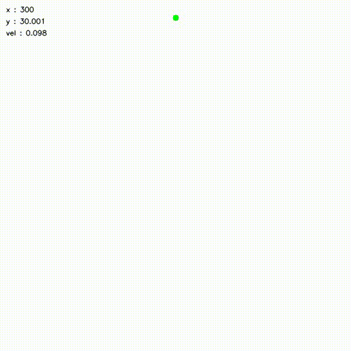
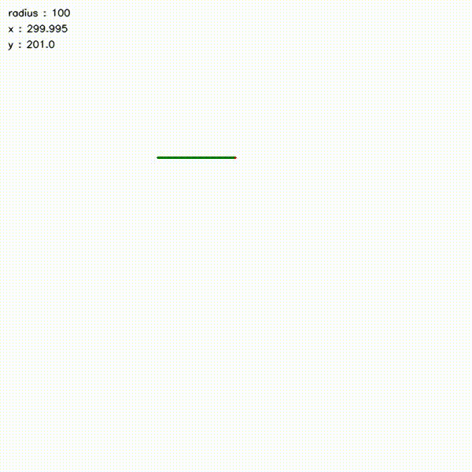

A simple wrapper on top of OpenCV that greatly simplifies creating animations.

**Features**
- Exploits high speeds offered by OpenCV
- Extremely modular : Simply inherit the renderer in your simulation object, and override the draw function for drawing.
- Writing animation to file : By providing a path to the renderer, it also automatically saves the animation to an `mp4` file, saving you the hassle of searching for using 3rd party tools.


Several simple examples have been added to the repository.

### Usage

Define your simulation object, inherit the renderer within it.


```python
class Object(Renderer):
    def __init__(self, recordLocation = None):
        super().__init__(recordLocation = recordLocation)
        self.its = 0

    def draw(self, image):
        '''
        fill in your drawing function here. Use opencv primitives to modify the image array
        '''
        return image

    def getInfo(self):
        '''
        return a dictionary with whatever you want to write. Make sure the value of the objects in the dictionary have a string representation!
        '''
        info = {
            'position' : self.position,
        }
        return info

    def step(self, dt):
        '''
        define your simulation here
        '''
        pass

```

After defining your class, run the main loop as:

```python
obj = Pendulum(recordLocation= 'output.mp4')   #recordLocation, if provided, saves the animation to the path 
for i in range(3000):
    obj.step(0.01)
    if i % 10 == 0:
        obj.render(height= 600, pause = 1) # pause is the number of ms to wait after each render instance. 1 is default

obj.plot() # plotting
```
### Demo

Pendulum simulation with non linear ODE solution


Falling object simulation



Drawing a simple circle



### Todo

- Not very efficient in blitting new objects on screen; simply refreshes the entire screen. Can probably make this faster by updating only changed portions.
